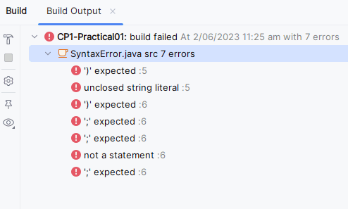
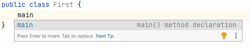

## Syntax, Semantics and Program Development Tools

### Aims and Objectives

This part of the laboratory has been designed to help you to

* become more familiar with the program development environment _IntelliJ_,
* use _IntelliJ_ to compile and execute Java applications (programs),
* recognise and correct syntax, semantic and logical errors in simple Java applications and
* write a complete, small Java application.


### Task 1: Syntax Errors (Checkpoint 1)

“Syntax” refers to the sequence in which the basic elements of a program (identifiers, reserved words, literals and
other symbols such as “+”) appear. Java has a set of rules which define exactly how these symbols can be put together to form programs.

The compiler will not translate (attempt to compile) a program unless it is free of syntax errors. Examples of syntax errors are:

- a missing semicolon (a semicolon indicates the end of a statement)
- misspelling a reserved word
- using a reserved word where an identifier is expected
- not terminating a string with a quotation mark
- incorrectly formed numbers, for example, two decimal points in the one number
- not enclosing the body of a class within braces ({})

Another related error is the pragmatic one of not giving a file the same name as the class it contains or not including
a main method.

1. Select the file `SyntaxError.java`.
2. You will notice in _IntelliJ_ that the code will (by default) be displayed in grey text. This is because all the code
   for SyntaxError has been “commented out”. This means that there is a line at the top of the file containing the
    symbols `/*` , and a line at the bottom containing the symbols `*/` (note the order of the characters). In
   terms of the Java language, this means that everything in this file has been turned into a *comment*, and so the
   content of the file between the two lines `/*` and `*/` will be ignored by the Java compiler. “Commenting out” is a
   technique that programmers sometimes use to hide code temporarily (for example, to see what the effect is of removing
   a line from a program, without actually deleting it and having to type it in again later).
3. This style of indicating a comment is for comments that run over several lines. Java has another style of commenting
   that indicates only a single line as a comment; we will use that style in Checkpoint 2 below.
4. Now “comment the code back in again” – in other words, delete the line `/*` at the top, and the line `*/` at
   the bottom (Another way to do this is to highlight all the code including the `/*` and `*/` and then
   using your keyboard on Windows type <kbd>Ctrl + Shift + /</kbd> and on macOS <kbd>Cmd + Opt + /</kbd>).
   This restores all the code that was inside the comment block, and the compiler will now read the file and
   try to understand it as a legitimate Java program. You will probably see the colour coding of the text changing in
   IntelliJ.
5. The program will not run as it is, because it contains a number of errors. The errors typically will be either
   red text or red-underlined text. Run the program you should see output similar to:  
     
   The information is all to do with lines 5 and 6 of the file so locate the first line with errors
   and determine what is wrong with that line and correct it. Fix as many of the other errors as you can and then try to
   run the program. Repeat the above steps until all the syntax errors have been corrected.

---

### Task 2: Semantic and Logical Errors (Checkpoint 2)

#### Semantic Errors

Semantic errors result from programs which although syntactically correct, do not make sense according to the way the
language is defined. For example, the following expression is valid.
<pre>
"one" + "two"
</pre>
The plus sign (+) acts to concatenate two strings and not as arithmetic addition (like the use of the word “hack” in
English which can mean a type of horse, a pick, or a quick program fix depending on its context).

The following expression is invalid since minus can only be applied to a number (there is no interpretation of minus
being applied to a string).
<pre>
"one" - "two"
</pre>
Another common form of semantic error is mistyping the name of a method or class. In this case the compiler will not
recognise the name as a valid method or class name. For example, in the following statement the name of the `println` method
has been mistyped.

```
System.out.pritnln("Hello");
```

#### Logical Errors

Logical errors result from writing program code which does not perform the desired actions. That is, there is a mismatch
between what the programmer thought the code would compute and what it actually computes.

A simple example of this is misplaced or missing bracketing in an expression. For example, the value of the following
expression
<pre>
3 + 4 + "5"
</pre>
is the string <samp>"75"</samp> since Java interprets the expression from the left to give 3 + 4 &rarr; <samp>7 +
"5"</samp> and finally <samp>"75"</samp>. If the programmer expected the value to be <samp>"345"</samp> then brackets
should have been
introduced to force Java to interpret the expression from the right (the part in brackets first), as in:
<pre>
3 + (4 + "5")
</pre>
Note that both expressions are _semantically_ and _syntactically_ correct but the first does not calculate the desired
result. Although the example is not realistic (the programmer could simply write "345"), once we start using variables,
similar, but realistic, problems will arise.

Your next task is to correct semantic and logical errors in an existing program.

1. This time select the file `SemanticError.java`.
2. In SemanticError, there are three lines inside the `main()` method block that have been commented out. This time we
   have used the other style of commenting in Java, where we use the symbols `//` to indicate that everything occurring to
   the right of these symbols, until the end of the line, should be treated as a comment. In other words, these three
   lines, even though they are valid Java, are not treated as Java by the compiler, but are simply ignored.
3. Now put the lines back into the program, by simply removing the `//` symbols at the beginning of each line. Now you
   have a program which is syntactically correct, but contains semantic errors (This can be done on Windows by
   putting your cursor anywhere in the line and pressing <kbd>Ctrl + /</kbd>, or on macOS by pressing <kbd>Cmd +
   /</kbd>, or by selecting all lines and using the same keystrokes for your particular operating system).
4. Run the program and use the same process as above to correct the semantic errors. Your corrections should alter as
   little of the file as possible (add, remove or change as few characters as possible). When the corrected program is
   executed it should produce the following output:

   ```
   3 plus 8 is greater than 10, and
   9 divided by 3 equals 3.
   Well done!
   ```
   Ensure that you have formatted the output **_exactly_** as above.

---

### Task 3: More syntax, semantic and logical errors (Checkpoint 3)

This task requires you to remove all errors in the files: `DebugOne`, `DebugTwo`, and `DebugThree`. Once completed
your outputs should be the following (ensure they are **_exactly_** as below):

1. ```
   Hello, CP1
   ```
2. ```
   Java programming is fun.  
   Getting a program to work  
   can be a challenge,  
   but when everything works correctly,  
   it's very satisfying  
   ```
3. ```
   This output is on the same line as the last one.  
   But this is on a new line.
   ```


---

### Task 4: Creating a Program (Checkpoint 4)

So far we have worked with existing programs. We will now create a Java program and go through the same process of
correcting all the syntax and semantic errors to produce a program that will execute. Your program may still have
run-time errors which are semantic errors which cannot be detected by the compiler. Run-time errors are reported by the
interpreter and should be located and corrected in a manner similar to the other types of errors.

Proceed as follows:

1. Create a new file by either:
   1. right-clicking on the `src` folder and selecting <tt>New</tt> from the fly-out menu and
      then selecting <tt>Java Class</tt>, or
   2. by selecting the `src` folder and pressing <kbd>Alt + Insert</kbd> (Windows), or <kbd>Cmd + N</kbd> (macOS) and
      selecting <tt>Java Class</tt>
2. In the Name prompt that appears, type `First`, and press <kbd>Enter/Return</kbd> on your keyboard. You should see:

   ```java
      public class First {
      }
   ```

3. Place your cursor between the `{ }` of the `First` class and type _main_. You should see a panel similar to the following
   appear:<br><br>
     
   Press Enter/Return on your keyboard to generate the main method. Your editor window should now contain the following:

   ```java
    public class First {
       public static void main(String[] args) {
   
       }
    }
   ```   

Within the main method write the application logic according to the following specification. Identify and correct any
errors and then execute (run) the program.

_**Specification:**_ Your task is to write a Java program which produces the output **_exactly_** as it appears below:


```
98 = 7 * 14 (answer 1)
54 + 12 = 66 (answer 2)

The ideas of "sequence", "selection", and "iteration"
are fundamental to most programming.
```

In each case, **the answer must be calculated by your program** rather than appearing literally in a string. All integers
must appear as integer literals (not strings) in your program. For example, the 96 in the first line of output should be
generated by multiplying 12 by 8 and the 12 and 8 should be literal integers and not strings. The text must be
formatted as shown.  <br><br>

**Hint:** the `println` method will always output a new line, so println-ing an empty string will effectively result in a line break.

**Hint:** Page 89 of the text book explains how to include quotes in a string, or if you don't have a copy of the
text book check the notes for the section on _escape sequences_ (see the video lecture on Character Strings in Module 2).

--- 